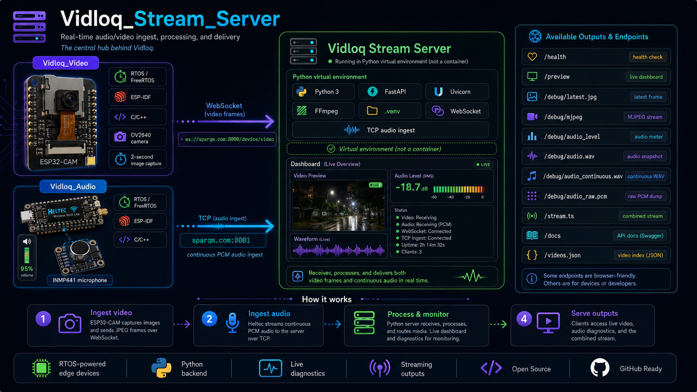

# Vidloq Stream Server



Vidloq Stream Server is the central Python backend for the Vidloq system. It receives video frames from **Vidloq_Video**, receives continuous microphone audio from **Vidloq_Audio**, exposes live debug endpoints, and provides browser-friendly diagnostics for validating the full audio/video pipeline.

The project is designed for local development, lab testing, GitHub portfolio presentation, and embedded streaming experiments using ESP32-class RTOS devices.

## What this server does

- Receives JPEG video frames from the ESP32-CAM firmware over WebSocket.
- Receives continuous PCM microphone audio from the Heltec/INMP441 firmware over raw TCP.
- Stores the latest video frame in memory for browser preview and diagnostics.
- Buffers recent audio in memory and exposes it as WAV and raw PCM debug output.
- Provides a dark Vidloq homepage with all supported URLs.
- Provides interactive documentation at `/docs` with expandable endpoint details and in-page request testing.
- Provides `/videos.json` as a machine-readable Vidloq endpoint index.
- Runs inside a Python virtual environment using `.venv`.
- Restarts automatically once per hour through `run_server.sh` to reduce manual recovery during long test sessions.

## Technology stack

| Area | Technology |
|---|---|
| Language | Python 3 |
| Web framework | FastAPI |
| ASGI server | Uvicorn |
| HTTP endpoints | FastAPI routes |
| Video ingest | WebSocket |
| Audio ingest | Raw TCP socket |
| Audio format | 16 kHz, 16-bit, mono PCM |
| Audio debug output | WAV and raw PCM |
| Video debug output | JPEG and MJPEG |
| Stream output | MPEG-TS endpoint placeholder / integration route at `/stream.ts` |
| Runtime environment | Python virtual environment `.venv` |
| Media tooling | FFmpeg-ready architecture |
| Documentation UI | Custom dark interactive docs page |
| Deployment helper | `run_server.sh` hourly restart wrapper |

This project intentionally uses a Python virtual environment. It is **not** a Docker/container project.

## How the Vidloq projects work together

```text
Vidloq_Video  ── WebSocket JPEG frames ──>  Vidloq Stream Server
Vidloq_Audio  ── TCP PCM audio stream  ──>  Vidloq Stream Server
                                                │
                                                ├── Browser preview
                                                ├── Video debug endpoints
                                                ├── Audio debug endpoints
                                                ├── Interactive docs
                                                └── Combined stream endpoint
```

### Vidloq_Video interaction

`Vidloq_Video` runs on the ESP32-CAM using ESP-IDF and RTOS/FreeRTOS. It captures camera frames and uploads them to the stream server through the WebSocket ingest route.

```text
ws://sparqm.com:8000/device/video
```

The server expects JPEG bytes from the device. After frames arrive, the latest image can be viewed through:

```text
http://sparqm.com:8000/debug/latest.jpg
```

The MJPEG debug stream is available at:

```text
http://sparqm.com:8000/debug/mjpeg
```

### Vidloq_Audio interaction

`Vidloq_Audio` runs on the Heltec Wireless Stick Lite using ESP-IDF and RTOS/FreeRTOS. It captures microphone data from the INMP441 module, converts it to 16-bit mono PCM, and streams the audio continuously to the server over TCP.

```text
sparqm.com:8001
```

The audio stream uses this format:

```text
Sample rate: 16000 Hz
Channels: 1
Bit depth: 16-bit PCM
Transport: raw TCP frame ingest
```

After audio arrives, it can be tested through:

```text
http://sparqm.com:8000/debug/audio_level
http://sparqm.com:8000/debug/audio.wav
http://sparqm.com:8000/debug/audio_continuous.wav
http://sparqm.com:8000/debug/audio_raw.pcm
```

## Configuration

The server uses simple values near the top of `main.py` and can also read the display/public host from an environment variable.

| Setting | Default | Purpose |
|---|---:|---|
| `SERVER_HOST` | `sparqm.com` | Public host used when the homepage builds visible URLs |
| `AUDIO_TCP_HOST` | `0.0.0.0` | Interface used for raw audio TCP ingest |
| `AUDIO_TCP_PORT` | `8001` | Port used by Vidloq_Audio |
| HTTP port | `8000` | Port used by the FastAPI/Uvicorn web server |
| `SAMPLE_RATE` | `16000` | Expected audio sample rate |
| `CHANNELS` | `1` | Expected audio channel count |
| `BITS_PER_SAMPLE` | `16` | Expected PCM bit depth |
| `MAX_AUDIO_SECONDS` | `60` | Amount of recent audio kept in memory |

To override the displayed server host without editing the code:

```bash
SERVER_HOST="sparqm.com" ./run_server.sh
```

For local-only testing, use:

```bash
SERVER_HOST="192.168.68.87" ./run_server.sh
```

The firmware projects should be configured separately in their own `main/config.h` files. The server domain, Wi-Fi credentials, and USB serial ports belong in the firmware project configuration files, not inside the stream server.

## Setup

Create and start the server from the project folder:

```bash
python3 -m venv .venv
source .venv/bin/activate
python -m pip install --upgrade pip setuptools wheel
python -m pip install -r requirements.txt
./run_server.sh
```

The preferred long-running command is:

```bash
./run_server.sh
```

The script will:

- Detect and rebuild stale virtual environments.
- Install Python requirements.
- Clear old listeners on ports `8000` and `8001`.
- Start Uvicorn through `python -m uvicorn` to avoid stale script shebang issues.
- Restart the server every hour.

## Main URLs

| URL | Purpose | Data required |
|---|---|---|
| `/` | Dark Vidloq homepage with all URLs | No |
| `/docs` | Interactive Vidloq API documentation | No |
| `/health` | Server status, counters, and device state | No |
| `/preview` | Browser dashboard / live preview page | No |
| `/debug/latest.jpg` | Latest JPEG frame from Vidloq_Video | Requires video frames first |
| `/debug/mjpeg` | Browser-friendly MJPEG stream | Requires video frames first |
| `/debug/audio_level` | Current microphone level and audio status | Requires audio frames for live data |
| `/debug/audio.wav` | WAV snapshot from the current audio buffer | Requires audio frames first |
| `/debug/audio_continuous.wav` | Continuous WAV debug export from TCP audio | Requires audio frames first |
| `/debug/audio_raw.pcm` | Raw PCM debug output | Requires audio frames first |
| `/stream.ts` | Combined stream endpoint for VLC/app testing | Requires media input for useful output |
| `/videos.json` | Machine-readable Vidloq endpoint list | No |
| `/admin/reset` | Clears buffers and counters | POST request required |
| `/device/video` | WebSocket ingest used by Vidloq_Video | JPEG bytes over WebSocket |
| `sparqm.com:8001` | TCP ingest used by Vidloq_Audio | Framed PCM audio over raw TCP |

## Recommended validation order

1. Start the stream server with `./run_server.sh`.
2. Open the homepage:

```text
http://sparqm.com:8000/
```

3. Check server health:

```text
http://sparqm.com:8000/health
```

4. Start `Vidloq_Video` and confirm:

```text
http://sparqm.com:8000/debug/latest.jpg
```

5. Start `Vidloq_Audio` and confirm:

```text
http://sparqm.com:8000/debug/audio_level
http://sparqm.com:8000/debug/audio_continuous.wav
```

6. After both audio and video are working, test:

```text
http://sparqm.com:8000/stream.ts
```

## Troubleshooting

### The server will not start

Run:

```bash
./run_server.sh
```

The script removes stale listeners on ports `8000` and `8001`, rebuilds broken virtual environments, and launches Uvicorn safely through the venv Python interpreter.

### The homepage loads but no image appears

Start or reset `Vidloq_Video`, then check whether the server health page shows video frames arriving. The latest image endpoint needs at least one JPEG frame from the WebSocket device.

### Audio endpoints are silent

Start or reset `Vidloq_Audio`, then check `/debug/audio_level`. The TCP audio path expects continuous framed PCM audio on port `8001`.

### `/stream.ts` does not look correct

Validate the debug endpoints first. The combined stream should be tested only after `/debug/latest.jpg` and `/debug/audio_continuous.wav` are both working.

## Repository structure

```text
Vidloq_Stream_Server/
├── main.py
├── requirements.txt
├── run_server.sh
├── README.md
└── docs/
    └── images/
        └── vidloq_stream_server_architecture_overview.png
```

## Related projects

- **Vidloq_Video** — ESP32-CAM RTOS firmware that sends JPEG frames to the stream server.
- **Vidloq_Audio** — Heltec/INMP441 RTOS firmware that sends continuous PCM audio to the stream server.

## Designed by

Designed by **Harold Paulino**.
